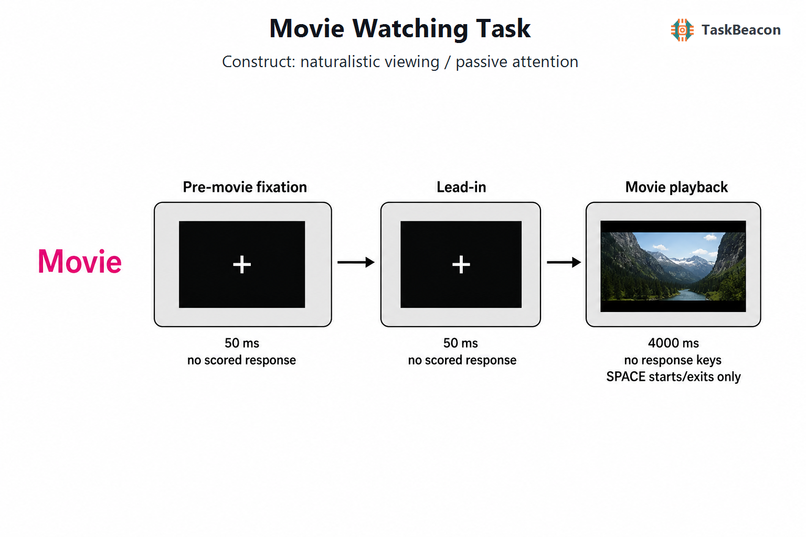

# 自然刺激电影观看范式：共同神经动力学、个体差异及其测量边界

实验室中的孤立刺激与离散试次便于控制变量，却压缩了现实认知的连续性：自然观看同时包含快速变化的视觉与听觉特征、跨秒至跨分钟的叙事积累、社会推断、情绪波动和自发注意。电影观看范式（movie-watching paradigm）以时间结构完全一致的视听序列约束参与者，同时允许多种心理过程在连续情境中展开，因而为研究外部刺激如何塑造共同神经反应、脑网络如何随事件边界重组以及个体差异如何在相同情境下显现提供了方法学折中（Sonkusare et al., 2019）。该范式并无固定刺激、固定时长和唯一因变量；其科学效力取决于影片内容、对照条件、同步精度、注释体系和分析模型能否共同界定待检验构念。

## 1. 方法学起源与理论问题

电影范式不存在可被合理指定为唯一“原始论文”的单一起源。早期研究沿两条互补路线形成其方法学基础。第一条路线将电影随时间变化的颜色、面孔、语言和身体等特征进行独立评分，再以这些连续特征解释功能磁共振成像（functional magnetic resonance imaging, fMRI）的血氧水平依赖（blood-oxygen-level-dependent, BOLD）信号。结果表明，在多特征同时出现的自然观看中，功能专门化仍可识别，由此确立了“连续刺激特征—脑反应”编码分析的可行性（Bartels & Zeki, 2004）。第二条路线不预先指定刺激模型，而以观看同一影片的其他参与者作为预测模型，计算跨被试相关（intersubject correlation, ISC）。Hasson 等（2004）发现，共同时间进程不仅见于初级视听区，也延伸至部分联合皮层；随后“神经电影学”工作比较不同影片及剪辑方式，说明电影形式对观看者脑活动和眼动的约束程度并不相同（Hasson et al., 2008）。因此，ISC 仅量化被共同刺激时间锁定的反应成分；将其泛化为一般意义上的“脑同步”或某一单独心理过程缺乏依据。

这一转向改变了实验控制的定义。传统设计主要通过删减情境降低变量共变；电影研究则保留共变结构，再借助时间打乱、重复观看、注意操控、逐时刻标注和计算特征分解来源。自然刺激提高了情境丰富性，但不会自动产生构念效度。镜头切换、声学包络、面孔出现、情绪唤醒和叙事事件经常同步变化，任何神经差异都需通过对照或模型比较确定其解释范围（Nastase et al., 2019）。

## 2. 任务逻辑、流程与核心测量

典型实验先呈现注视或基线，随后连续播放短片、完整叙事片段或多段影片。被动版本要求保持观看且不在播放中作答，以避免运动反应打断连续加工；主动版本可加入注意分配、内容打乱或重复观看条件，并在片后采集理解、记忆、情绪效价、唤醒或投入度评分。电影范式没有通用的单试次时长、反馈或阶梯程序：短片可持续数秒至数分钟，完整叙事可跨多个扫描段；通常不提供逐试次正确性反馈，也不根据表现自适应调节难度。影片起止、镜头切换、事件边界及附加标注必须与 EEG、MEG 或 fMRI 时间轴精确对齐。

依赖变量随问题而定。刺激编码模型检验低层视听或高层语义特征对单个参与者信号的解释量；ISC 将某参与者的时间序列与其余参与者平均序列或全部配对序列相关，用于估计共同刺激驱动成分；跨被试功能相关（intersubject functional correlation, ISFC）将一个人的某脑区与其他人的另一脑区相关，以削弱同一被试内的非神经共波动并考察刺激锁定的网络耦合（Simony et al., 2016）。滑动窗功能连接、隐状态或低维轨迹用于刻画网络转换；行为预测则以连接或同步特征预测认知、情绪及临床量表。自由观看下的注视轨迹、头动、呼吸和心率既可能是混杂，也可能是投入状态的组成指标，需依据研究问题预先界定。

具体对比决定构念解释。原始顺序相对于时间打乱顺序可检验跨时段叙事整合，但两者也在可预测性和注意维持上不同；专注观看相对于内在心算分心可操作注意投入；首次相对于重复观看同时涉及新奇性、记忆和预期；情绪片段相对于中性片段同时改变唤醒、视觉运动和声学强度。对没有显式条件的单影片设计，时间点间变化只能在获得可靠影片注释并控制共变特征后归因于特定心理过程。

## 3. 主要行为与神经科学发现

### 3.1 共同反应、注意与情绪时间进程

跨被试一致性反映刺激驱动、注意状态和内容结构的共同作用。EEG 的相关成分分析从多通道信号中提取跨观看或跨个体最一致的线性组合，显示相关峰可在秒级对应高唤醒片段；重复观看或打乱叙事顺序会降低一致性（Dmochowski et al., 2012）。在保持视听输入基本相同的条件下，将注意转向心算显著降低 EEG 的跨被试可靠性，且具有连贯叙事的视听材料比缺乏语义的材料更能区分注意状态，支持 ISC 对投入状态敏感，但不支持将其等同于注意的纯测量（Ki et al., 2016）。群体神经反应的时间可靠性还可关联较大受众的偏好，但该关联同时受影片选择和传播情境影响，不能据此推断单个观看者的主观喜好（Dmochowski et al., 2014）。

频谱分辨的 EEG 证据进一步表明，情绪片段相较中性片段在多个频带产生更高 ISC，高唤醒片段的低频与伽马频段效应尤为明显；头皮分布随频率而变化，提示自然情绪加工包含不同时间尺度的共同成分（Maffei, 2020）。然而，头皮 EEG 的频带 ISC不能单独定位皮层来源。近期单镜头视频研究发现，常用视频特征与 EEG 的相关很大程度可能由镜头切换驱动；控制切换后，物体层特征具有更稳健的解释力（Yao et al., 2024）。这项结果直接限定了“语义追踪”结论：若模型未显式控制剪辑瞬变和眼动，共同视觉诱发反应可能被误写为高层理解。

### 3.2 fMRI 网络组织与跨模态证据

fMRI 研究较一致地显示，电影将多脑区活动锁定到共同事件序列，同时保留高阶区域的个体差异。电影观看期间可识别比静息状态更丰富、转换更稳定的全脑状态，部分状态转换在不同参与者及重测会话间对齐到特定影片事件，并与主观投入相关（van der Meer et al., 2020）。电影、静息和传统任务的直接比较还显示，电影条件下全脑功能层级和时间不可逆性呈不同组织；这类生成模型结果支持自然观看对网络动力学施加系统约束，但模型拟合的有效连接不能直接替代干预意义上的因果证据（Kringelbach et al., 2023）。

共同约束与个体可识别性可以并存。基于 Human Connectome Project 数据，电影观看功能连接对认知和情绪特质的交叉验证预测优于静息连接，且少于三分钟的部分片段已包含预测信息；社会内容较丰富的片段效果更好（Finn & Bandettini, 2021）。近期深度学习分析同样发现，较高的认知预测准确率与更强 ISC 以及影片中面孔和人声持续时间相关，但这种关系没有同样出现在性别预测中，说明刺激选择与目标变量之间存在特异匹配（Zhang et al., 2026）。完整叙事影片的网络连接相似性则随片段、效价和唤醒变化，表明“个体特征”估计不能脱离正在发生的故事内容（Mochalski et al., 2024）。

EEG/MEG 补充了 fMRI 难以分辨的快速过程。公开的两小时《阿甘正传》MEG 数据将毫秒级动力学与既有 fMRI、眼动及影片注释连接起来，为跨模态复现提供了标准化资源（Liu et al., 2022）。两类模态回答的问题不同：fMRI 更适合描述共同反应和连接的空间分布，EEG/MEG 更适合检验镜头、声学变化和事件更新后的时间过程；跨模态一致并不意味着测得同一生理信号。

## 4. 发展、临床与发展性应用

电影对任务要求低且能维持观看，因而适用于儿童和难以完成复杂指令的人群。EEG 大样本研究发现，自然视频诱发的跨被试相似性随年龄增长而降低，并在独立队列复现；该结果更适合解释为发展过程中反应多样性增加，不能简单归结为注意下降（Petroni et al., 2018）。在孤独症研究中，典型成人对同一影片表现较高群体间一致性，孤独症成人则呈较低群体 ISC、但同一人重复观看具有较高个体内一致性，提示其反应可能稳定而更具个体特异性（Hasson et al., 2009）。这种群体分布差异不构成个体诊断标志，且可能受到眼动、感官敏感性、理解程度和样本异质性影响。

电影范式也从群体平均拓展到个体预测、自然情绪、教育投入和精神病学参照常模。其优势在于一次采集可同时分析多个时间尺度与内容维度；代价是研究者在影片版权、语言文化、既往观看经历和注释成本之间作出明确取舍。开放刺激与数据集有助于复现，但不同影片的感知和叙事统计并不等价，跨数据集推广需要多影片、独立样本和预注册模型。

## 5. 信度、效度与解释边界

电影可提高某些指标的稳定性，却不存在“自然刺激整体更可靠”的一般结论。自然观看下动态功能连接的全局重测信度低于静态连接；与静息相比，电影可提高若干动态指标及视觉、边缘和默认网络区域的信度（Zhang et al., 2022）。脑状态跨会话重现和行为预测改善支持其测量潜力，但群体平均的稳定时间锁定效应不保证个体排序可靠。研究设计应分别报告群体效应、个体内重测和个体差异指标的信度。

构念效度的主要威胁来自多重共线性和刺激特异性。高 ISC 可能由低层感官同步、共同眼动、叙事理解或情绪唤醒产生；低 ISC 也可能反映注意游离、不同解释、噪声或时间配准误差。被动观看没有在线正确反应，减少了运动伪迹，却也缺少逐时刻行为效标。片后测验只能确认总体观看或记忆，难以定位瞬时认知状态。对组间差异的解释需控制视听能力、语言理解、既往暴露、头动和生理噪声，并采用镜头切换、声学包络、亮度、光流、面孔和语义等竞争模型。

统计推断还受到数据依赖结构约束。配对 ISC 中，同一参与者同时进入多个配对，观测值不能视为相互独立；时间序列又具有显著自相关，任意打乱时间点会破坏原有谱结构。适当方法包括留一法 ISC、保持时间自相关的相位置换或区块置换，以及在参与者层面进行汇总和推断（Nastase et al., 2019）。分析窗口、滞后、滤波和多重比较方案应在观察结果前确定。

生态效度还需区分“刺激丰富”与“现实互动”。电影是导演和剪辑预先组织的单向输入，观看者不能改变事件进程；其结果未必推广到真实社会互动。单一影片得到的 ISC、连接—行为关系或临床差异可能依赖特定内容。稳健推断应在多部影片、不同文化与年龄样本中复现，并将影片作为抽样因素，而非固定且可忽略的实验载体。自然观看适合发现复杂情境下的时间结构和个体差异，但精确构念确认仍需与可控任务、行为测量或干预设计互证。

## 6. TaskBeacon 中的任务实现

### 6.1 任务资源与访问入口

| 资源 | ID | 用途 | 地址 |
|---|---|---|---|
| 完整实验实现 | T000007 | PsychoPy/PsyFlow 的行为与 EEG 采集任务，包含实验、区组和影片起止事件标记 | [源码仓库](https://github.com/TaskBeacon/T000007-movie) |
| 浏览器预览 | H000007 | 与当前简短流程对齐的行为型网页预览；不提供外部 EEG 硬件触发 | [源码仓库](https://github.com/TaskBeacon/H000007-movie) |
| 在线体验 | H000007 | 在浏览器中体验预览流程 | [公开运行入口](https://taskbeacon.github.io/psyflow-web/?task=H000007-movie) |

T000007 是当前研究实现；H000007 用于浏览器预览，不能作为具有硬件事件同步能力的 EEG 采集版本的等价替代。两者当前均采用仓库内生成的参考短片，而非特定商业影片。

### 6.2 实现流程与关键参数

TaskBeacon 当前版本采用 1 个区组、1 个 `movie` 条件和 1 个试次。全屏窗口为 1920 × 1080，黑色背景；影片以 22.1° × 12.4° 的视角大小居中呈现。指导语要求注视屏幕中央并减少运动；空格键仅用于开始和结束界面。播放期间不采集按键，不计算正确率或积分，也没有反馈和自适应控制。主要输出是各阶段的呈现记录、条件及电影起止时间标记，适合检查连续 EEG 与影片时间轴的同步关系；4 秒参考片仅用于可复现演示，正式研究应替换为经授权且与研究问题匹配的刺激，并重新界定分析单位。

**图 1. TaskBeacon T000007 的单试次流程与参数。** 唯一条件 `movie` 依次进入播放前注视、引导和影片播放三个阶段：前两阶段均呈现中央白色“+”，各持续 50 ms；随后呈现 `assets/reference_movie.mp4`，持续 4000 ms。播放阶段的有效反应键为空，参与者无需作答；空格仅控制指导语后的开始及结束页退出。任务不设置正确/错误判定、得分、反馈、抖动或自适应调节，条件按固定顺序生成；完整实验实现分别在影片开始与结束发送 `movie_onset = 1` 和 `movie_offset = 2` 事件标记。当前配置为 1 个区组 × 1 个试次。

## 参考文献

Bartels, A., & Zeki, S. (2004). Functional brain mapping during free viewing of natural scenes. *Human Brain Mapping, 21*(2), 75–85. https://doi.org/10.1002/hbm.10153

Dmochowski, J. P., Bezdek, M. A., Abelson, B. P., Johnson, J. S., Schumacher, E. H., & Parra, L. C. (2014). Audience preferences are predicted by temporal reliability of neural processing. *Nature Communications, 5*, 4567. https://doi.org/10.1038/ncomms5567

Dmochowski, J. P., Sajda, P., Dias, J., & Parra, L. C. (2012). Correlated components of ongoing EEG point to emotionally laden attention—A possible marker of engagement? *Frontiers in Human Neuroscience, 6*, 112. https://doi.org/10.3389/fnhum.2012.00112

Finn, E. S., & Bandettini, P. A. (2021). Movie-watching outperforms rest for functional connectivity-based prediction of behavior. *NeuroImage, 235*, 117963. https://doi.org/10.1016/j.neuroimage.2021.117963

Hasson, U., Avidan, G., Gelbard, H., Vallines, I., Harel, M., Minshew, N., & Behrmann, M. (2009). Shared and idiosyncratic cortical activation patterns in autism revealed under continuous real-life viewing conditions. *Autism Research, 2*(4), 220–231. https://doi.org/10.1002/aur.89

Hasson, U., Landesman, O., Knappmeyer, B., Vallines, I., Rubin, N., & Heeger, D. J. (2008). Neurocinematics: The neuroscience of film. *Projections, 2*(1), 1–26. https://doi.org/10.3167/proj.2008.020102

Hasson, U., Nir, Y., Levy, I., Fuhrmann, G., & Malach, R. (2004). Intersubject synchronization of cortical activity during natural vision. *Science, 303*(5664), 1634–1640. https://doi.org/10.1126/science.1089506

Ki, J. J., Kelly, S. P., & Parra, L. C. (2016). Attention strongly modulates reliability of neural responses to naturalistic narrative stimuli. *The Journal of Neuroscience, 36*(10), 3092–3101. https://doi.org/10.1523/JNEUROSCI.2942-15.2016

Kringelbach, M. L., Sanz Perl, Y., Tagliazucchi, E., & Deco, G. (2023). Toward naturalistic neuroscience: Mechanisms underlying the flattening of brain hierarchy in movie-watching compared to rest and task. *Science Advances, 9*(2), eade6049. https://doi.org/10.1126/sciadv.ade6049

Liu, X., Dai, Y., Xie, H., & Zhen, Z. (2022). A studyforrest extension, MEG recordings while watching the audio-visual movie “Forrest Gump.” *Scientific Data, 9*(1), 206. https://doi.org/10.1038/s41597-022-01299-1

Maffei, A. (2020). Spectrally resolved EEG intersubject correlation reveals distinct cortical oscillatory patterns during free-viewing of affective scenes. *Psychophysiology, 57*(11), e13652. https://doi.org/10.1111/psyp.13652

Mochalski, L. N., Friedrich, P., Li, X., Kröll, J.-P., Eickhoff, S. B., & Weis, S. (2024). Inter- and intra-subject similarity in network functional connectivity across a full narrative movie. *Human Brain Mapping, 45*(11), e26802. https://doi.org/10.1002/hbm.26802

Nastase, S. A., Gazzola, V., Hasson, U., & Keysers, C. (2019). Measuring shared responses across subjects using intersubject correlation. *Social Cognitive and Affective Neuroscience, 14*(6), 667–685. https://doi.org/10.1093/scan/nsz037

Petroni, A., Cohen, S. S., Ai, L., Langer, N., Henin, S., Vanderwal, T., Milham, M. P., & Parra, L. C. (2018). The variability of neural responses to naturalistic videos change with age and sex. *eNeuro, 5*(1), ENEURO.0244-17.2017. https://doi.org/10.1523/ENEURO.0244-17.2017

Simony, E., Honey, C. J., Chen, J., Lositsky, O., Yeshurun, Y., Wiesel, A., & Hasson, U. (2016). Dynamic reconfiguration of the default mode network during narrative comprehension. *Nature Communications, 7*, 12141. https://doi.org/10.1038/ncomms12141

Sonkusare, S., Breakspear, M., & Guo, C. C. (2019). Naturalistic stimuli in neuroscience: Critically acclaimed. *Trends in Cognitive Sciences, 23*(8), 699–714. https://doi.org/10.1016/j.tics.2019.05.004

van der Meer, J. N., Breakspear, M., Chang, L. J., Sonkusare, S., & Cocchi, L. (2020). Movie viewing elicits rich and reliable brain state dynamics. *Nature Communications, 11*(1), 5004. https://doi.org/10.1038/s41467-020-18717-w

Yao, Y., Stebner, A., Tuytelaars, T., Geirnaert, S., & Bertrand, A. (2024). Identifying temporal correlations between natural single-shot videos and EEG signals. *Journal of Neural Engineering, 21*(1), 016018. https://doi.org/10.1088/1741-2552/ad2333

Zhang, X., Liu, J., Yang, Y., Zhao, S., Guo, L., Han, J., & Hu, X. (2022). Test-retest reliability of dynamic functional connectivity in naturalistic paradigm functional magnetic resonance imaging. *Human Brain Mapping, 43*(4), 1463–1476. https://doi.org/10.1002/hbm.25736

Zhang, Y., Finn, E. S., Sabuncu, M. R., & Kuceyeski, A. (2026). A view-engage-predict framework for enhancing brain-behavior mapping with naturalistic movie-watching fMRI. *Communications Biology*. Advance online publication. https://doi.org/10.1038/s42003-026-10411-9
